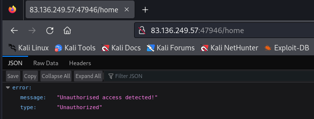
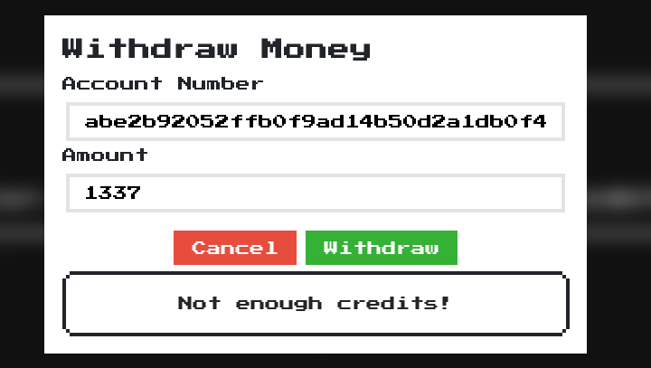
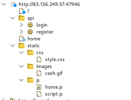
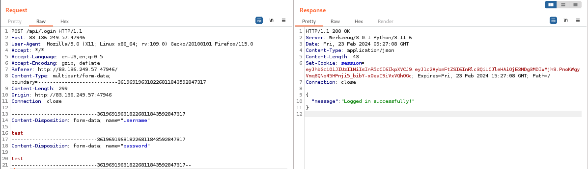
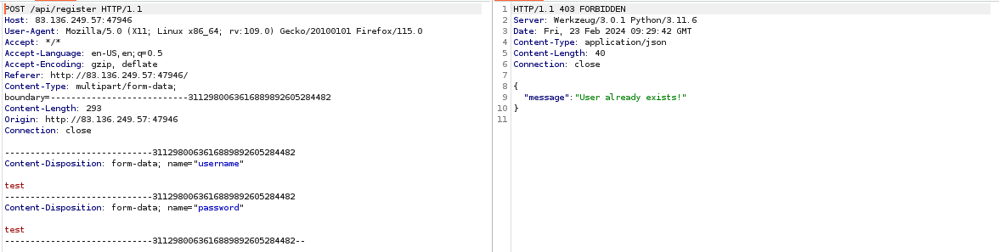
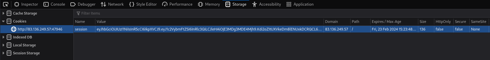
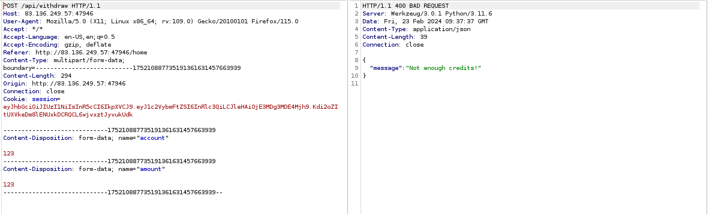
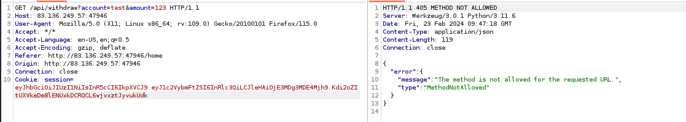
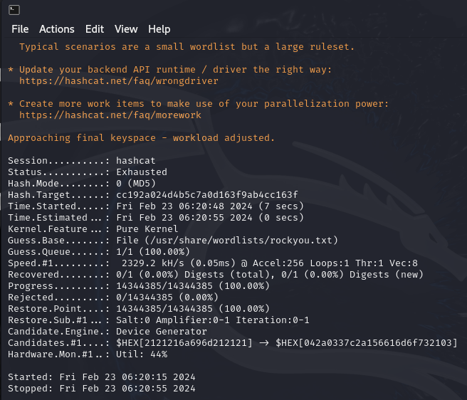

# Solve HTBank 
#### https://app.hackthebox.com/challenges/HTBank

##### By directory brute force with dirsearech
`dirsearch -u http://83.136.249.57:47946/ -x 404,403` 

Directoriea found:
/home                                             
/logout 

##### Try to access /home without authorization
 

##### The main page is /logout page 
Creat account with register function and login with it


##### Withdraw function 
 

### Analyizing the application with burp
 
##### login request 


##### Register request 


##### Cookies 

Note: that  `samesite` is none and `httponly` is false Also we found that the cookie is tied with the session (takes long time to expire)
##### Withdraw request


##### try yo change request from post to git



##### try to crack wallet hash

hash cann't be cracked with `rockyou.txt`

### Analyzing the Source code 
*You can find it in `src` folder*
The application uses : python - PHP - html - css - JS 
Database : mysql
Database name : web_htbank
Database tables : users - flag 
Database uesrname : xCl0w3n 
Database Password : xCl0w3n1337!!
Encripyion algorithms : HS256


#### Analizing the `database.py`
*You can find it in [database.py](src/web_htbank/challenge/flask_frontend/application/database.py) file*
Database Connection:
The script initializes a Flask-MySQLdb instance (mysql) to handle database connections.

``` python
from flask_mysqldb import MySQL

mysql = MySQL()
```

Database Query Function:
The query function executes SQL queries and returns the results as a list of dictionaries.

``` python
def query(query, args=(), one=False):
    cursor = mysql.connection.cursor()
    cursor.execute(query, args)
    rv = [dict((cursor.description[idx][0], value)
        for idx, value in enumerate(row)) for row in cursor.fetchall()]
    return (rv[0] if rv else None) if one else rv
```

User Authentication:

The login_user_db function checks if the provided username and password match a record in the 'users' table.
If a match is found, it generates a JWT token using the createJWT function from the 'application.util' module and returns the token.
``` python
def login_user_db(username, password):
    user = query('SELECT username FROM users WHERE username = %s AND password = %s', (username, password,), one=True)
    
    if user:
        token = createJWT(user['username'])
        return token
    else:
        return False
```

User Registration:
The register_user_db function checks if a user with the provided username already exists.
If the username is not found, it inserts a new user into the 'users' table with a generated wallet address and returns True.
If the username already exists, it returns False.

``` python
def register_user_db(username, password):
    check_user = query('SELECT username FROM users WHERE username = %s', (username,), one=True)

    if not check_user:
        query('INSERT INTO users(username, password, wallet_address) VALUES(%s, %s, %s)', (username, password, secrets.token_hex(16), ))
        mysql.connection.commit()
        return True
    
    return False
```

Get User Information and Flag:
The getUser and getFlag functions retrieve information from the 'users' and 'flag' tables, respectively.
``` python

def getUser(username):
    return query('SELECT * from users WHERE username = %s', (username, ))

def getFlag():
    return query('SELECT * from flag')
```
#### Analizing the `util.py`
*You can find it in [util.py](src/web_htbank/challenge/flask_frontend/application/util.py) file*
``` python
import os, jwt, datetime
from flask import jsonify, abort, session, make_response, request
from functools import wraps

# Generate a random key for JWT encoding/decoding
generate = lambda x: os.urandom(x).hex()
key = generate(50)

# Function to create a JWT with a specified username
def createJWT(username):
    token_expiration = datetime.datetime.utcnow() + datetime.timedelta(minutes=360)
    
    encoded = jwt.encode(
        {
            'username': username,
            'exp': token_expiration
        },
        key,
        algorithm='HS256'
    )

    return encoded

# Function to verify a JWT and decode its contents
def verifyJWT(token):
    try:
        token_decode = jwt.decode(
            token,
            key,
            algorithms='HS256'
        )

        return token_decode
    except:
        return abort(401, 'Invalid token!')

# Function to create a Flask response with a JSON message
def response(message):
    return make_response(jsonify({'message': message}))

# Decorator to check if the user is authenticated using JWT
def isAuthenticated(f):
    @wraps(f)
    def decorator(*args, **kwargs):
        token = request.cookies.get('session')

        if not token:
            return abort(401, 'Unauthorised access detected!')

        decoded_token = verifyJWT(token)

        return f(decoded_token=decoded_token, *args, **kwargs)

    return decorator
```

**Note that the key is randomly genrated each time**

#### Analizing the `WithdrawController.php`
*You can find it in [WithdrawController.php](src/web_htbank/challenge/php_backend/controllers/WithdrawController.php) file*

``` php
public function index($router)
{
    $amount = $_POST['amount'];
    $account = $_POST['account'];

    // Check if the amount is 1337
    if ($amount == 1337) {
        // If the amount is 1337, update the 'show_flag' column in the 'flag' table
        $this->database->query('UPDATE flag set show_flag=1');

        // Return a JSON response with the message 'OK'
        return $router->jsonify([
            'message' => 'OK'
        ]);
    }

    // If the amount is not 1337, return a JSON response with a rejection message
    return $router->jsonify([
        'message' => 'We don\'t accept that amount'
    ]);
}
```

#### Analizing the `database.php`
*You can find it in [database.php](src/web_htbank/challenge/php_backend/Database.php) file*

``` php
<?php
class Database 
{
    // Properties to store database connection details
    private $host;
    private $user;
    private $pass;
    private $dbName;

    // Static property to store the instance of the Database class
    private static $database = null;
    
    // Instance of the MySQLi class for database interaction
    private $mysql;

    // Constructor to initialize the class with database connection details
    public function __construct($host, $user, $pass, $dbName)
    {
        $this->host     = $host;
        $this->user     = $user;
        $this->pass     = $pass;
        $this->dbName   = $dbName;

        // Set the static $database property to the current instance
        self::$database = $this;
    }

    // Static method to get the instance of the Database class
    public static function getDatabase(): Database
    {
        return self::$database;
    }

    // Method to establish a connection to the MySQL database
    public function connect()
    {
        $this->mysql = new mysqli($this->host, $this->user, $this->pass, $this->dbName);
    }

    // Method to execute a prepared SQL query
    public function query($query, $params = [], $return = true)
    {
        // Variables to store types and final parameters for prepared statement
        $types = "";
        $finalParams = [];

        // Construct types and finalParams from the provided parameters
        foreach ($params as $key => $value)
        {
            $types .= str_repeat($key, count($value));
            $finalParams = array_merge($finalParams, $value);
        }

        // Prepare the SQL query
        $stmt = $this->mysql->prepare($query);

        // Bind parameters if they exist
        if ($finalParams) {
            $stmt->bind_param($types, ...$finalParams);
        }

        // Execute the statement
        if (!$stmt->execute())
        {
            return false;
        }

        // Return the result set for SELECT queries or success/failure for non-SELECT queries
        if (!$return)
        {
            return true;
        }

        return $stmt->get_result() ?? false;
    }
}
?>
```


>Find More on ==> github.com/MedhatHassan